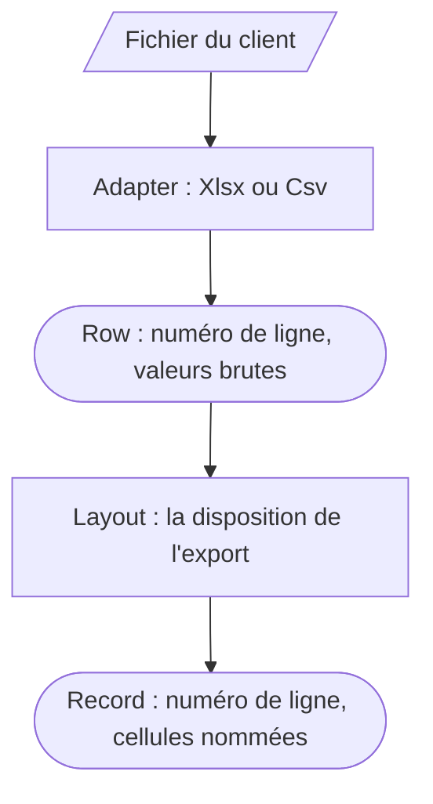
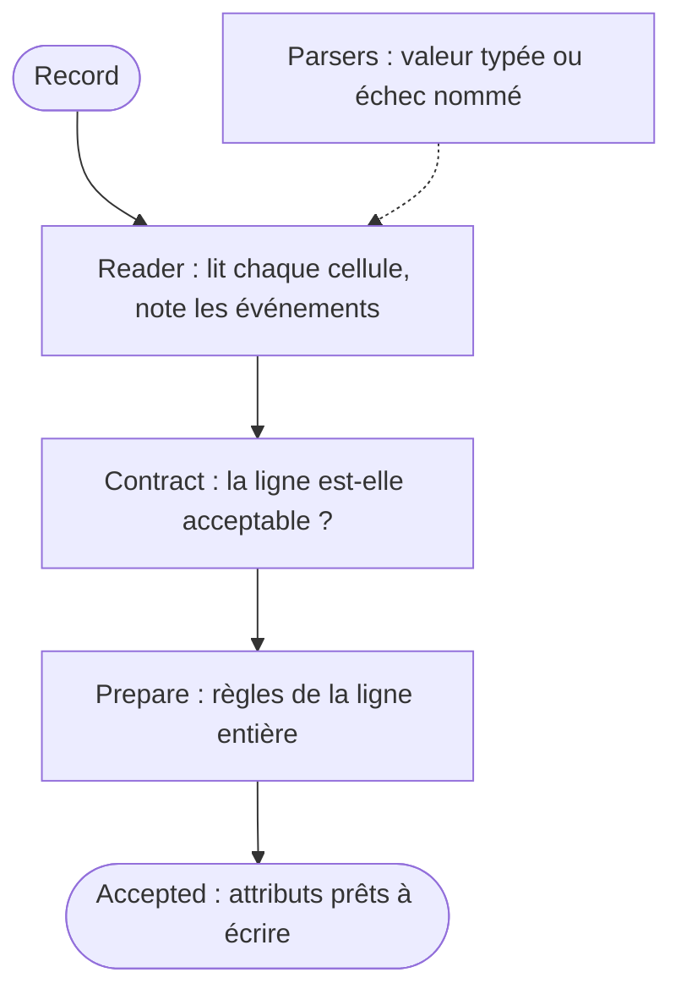
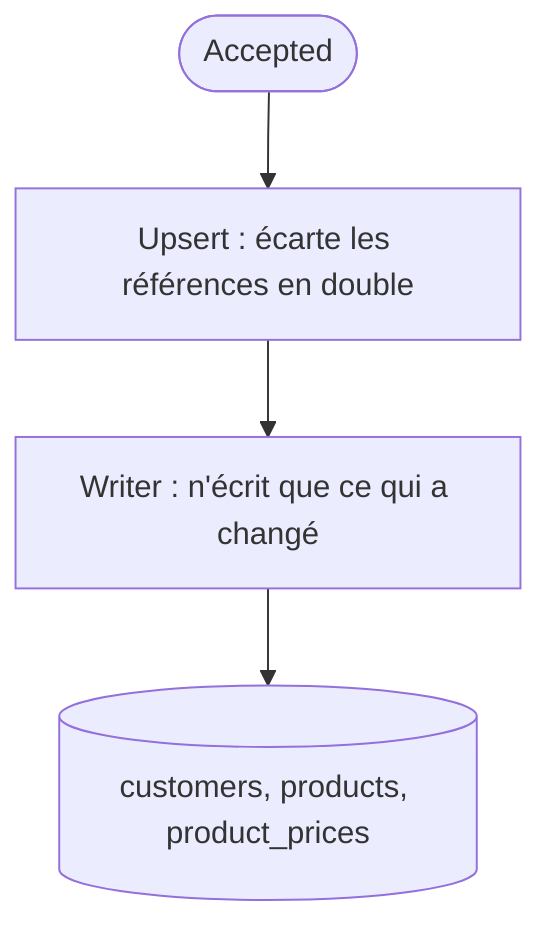
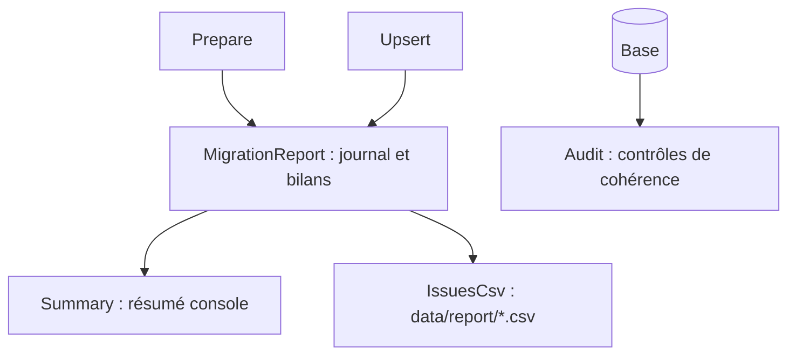

# Reprise CaveGest 4.2 → Baqio

Import des clients et du catalogue tarifaire d'un client quittant CaveGest 4.2, avec un rapport
lisible par ce client et des contrôles de cohérence sur la base obtenue.

## Sommaire

1. [Motivations](#motivations)
2. [Installation et commandes](#installation-et-commandes)
3. [Vue d'ensemble](#vue-densemble)
4. [Le flux, étape par étape](#le-flux-étape-par-étape)
   - [1. Adaptateur : lire un format](#1-adaptateur--lire-un-format)
   - [2. Disposition : lire un export](#2-disposition--lire-un-export)
   - [3. Parsers : lire une valeur](#3-parsers--lire-une-valeur)
   - [4. Lecteur : lire une ligne](#4-lecteur--lire-une-ligne)
   - [5. Contrat : accepter ou rejeter une ligne](#5-contrat--accepter-ou-rejeter-une-ligne)
   - [6. Préparation : de la ligne aux attributs](#6-préparation--de-la-ligne-aux-attributs)
   - [7. Écriture : des attributs à la base](#7-écriture--des-attributs-à-la-base)
5. [Le rapport](#le-rapport)
6. [Les contrôles après reprise](#les-contrôles-après-reprise)
7. [Schéma de données](#schéma-de-données)
8. [Tests](#tests)
9. [Arbitrages métier](#arbitrages-métier)
10. [Notes de reprise](#notes-de-reprise)
    - [Ce qui n'est pas repris](#ce-qui-nest-pas-repris)
    - [Bloquant : données manquantes](#bloquant--données-manquantes)
    - [À compléter : qualité des données](#à-compléter--qualité-des-données)
    - [À vérifier : anomalies ponctuelles](#à-vérifier--anomalies-ponctuelles)
    - [Corrections automatiques appliquées](#corrections-automatiques-appliquées)
    - [Limites connues](#limites-connues)

---

## Motivations

La définition d'une nouvelle architecture de services émane de l'étendue de l'exercice. J'aurais pu me contenter de modifier l'existant en rendant les normalizers plus robustes, mais mon approche me semble ouvrir une discussion portant sur les attentes concrètes du poste et sur les solutions apportées.

Le recours aux agents IA était contraire aux règles mais m'a permis d'aboutir à un pipeline découplant certaines responsabilités identifiées. Sans cela, l'évaluation aurait porté, à mon sens, principalement sur ma capacité d'implémentation.

Ce choix assumé ne reflète pas mon usage au quotidien. J'espère qu'il permettra de faire de l'entretien oral une discussion critique des choix architecturaux et de leurs limites face à vos besoins concrets, et d'amorcer ainsi un premier alignement lors de l'éventuelle prise de poste.

---

## Arbitrages métier

| Cas | Décision | Pourquoi |
|---|---|---|
| Une référence présente sur plusieurs lignes | Aucune version n'est reprise | Rien ne permet de choisir, l'ordre de lecture ne doit pas décider à notre place |
| La grille EXPO est saisie TTC | Convertie en HT avec le taux de TVA du produit | Annoncé par le préambule de l'export, et vérifié : EXPO converti égale DEPC au centime près pour 112 produits sur 113 |
| Une grille sans prix | Aucun tarif créé | Une cellule vide n'est pas un prix à 0 |
| Un montant illisible ou nul | Aucun tarif créé (le produit l'est) | Un prix douteux ne doit pas faire perdre un produit |
| Un contenant hors format (« 6 x 75 », « Carton 6 ») | Libellé d'origine conservé **et** interprété | Supposition à valider avec le client |
| Couleur en désaccord avec la section du catalogue | Les deux valeurs reprises, désaccord signalé | Seul le client sait laquelle fait foi |
| Sections sans appellation (EFFERVESCENTS, DIVERS) | Aucune appellation déduite | Mieux vaut vide qu'inventé |
| Tiers « revendeur », sans équivalent dans le modèle cible | Repris comme client, signalé | 981 tiers concernés |
| Tiers marqué « inutilisable » | Repris avec `active: false` | Aucune donnée perdue, le client décide de leur sort |
| Valeur illisible (e-mail, téléphone, date) | Champ vidé et signalé | Une valeur fausse en base coûte plus cher qu'une valeur absente |
| Valeur douteuse mais lisible | Reprise et signalée | Le client vérifie, nous ne corrigeons pas à sa place |
| Fichier du client | Jamais modifié à la main | Préambule, sections, sous-totaux et lignes vides sont écartés par le code |

---

## Installation et commandes

Prérequis : Ruby 3.3.4, PostgreSQL en cours d'exécution.

```bash
bin/setup          # dépendances, base de développement et base de test
bundle exec rspec  # 438 tests
```

Aucune configuration n'est nécessaire sur une installation PostgreSQL standard.
Si la connexion échoue, renseignez vos identifiants dans `.env`.

```bash
bin/rake db:setup                     # (re)crée la base à partir de db/schema.rb
bin/rake import:all                   # les deux imports, puis les contrôles
bin/rake import:customer:cavegest     # clients seuls
bin/rake import:product_price:cavegest # produits et tarifs seuls
bin/rake import:report                # contrôles seuls, sur la base existante
```

Chaque import écrit le détail de ses anomalies dans `data/report/`.

---

## Vue d'ensemble

La reprise se lit en quatre temps.

**1. Du fichier aux lignes**



**2. De la ligne aux attributs**



**3. Des attributs à la base**



**4. La traçabilité**



L'Audit part de la base, et non du pipeline : il vérifie le résultat, quelle que soit la façon dont
les données y sont arrivées.

| Objet | Responsabilité | Ignore |
|---|---|---|
| `Adapter` | décoder un format (encodage, séparateur, numéros de ligne) | le logiciel d'origine |
| `Layout` | où est chaque donnée dans l'export, et les conventions du logiciel | le format du fichier |
| `Parsers` | transformer une valeur brute en valeur typée, ou échouer | la ligne, le rapport |
| `Reader` | lire les cellules d'une ligne et noter les événements | la décision de rejeter |
| `Contract` | décider si une ligne est acceptable | la lecture, la base |
| `Prepare` | orchestrer et produire les attributs, sans rien écrire | le format, la persistance |
| `Upsert` | dédoublonner et écrire, de façon idempotente | le fichier d'origine |
| `Writer` | écrire une table sans réécrire l'inchangé | le métier |
| `MigrationReport` | journal des anomalies et bilans d'écriture | tout le reste |

Chaque étape est remplaçable : un nouveau client sur un autre logiciel se traduit par un nouvel adaptateur et une nouvelle disposition, sans toucher au reste.

---

## Le flux, étape par étape

Les sorties ci-dessous sont celles des fichiers réels du client.

### 1. Adaptateur : lire un format

Décode le fichier et le découpe en lignes numérotées comme le client les voit dans son tableur.
`Csv` détecte l'encodage (UTF-8, sinon Windows-1252) ; `Xlsx` lit le classeur via Roo et conserve les types des cellules.

```ruby
adapter = Importer::Adapter::Csv.new("data/export_tarifs_cavegest.csv",
                                     fallback_encoding: "Windows-1252", col_sep: ";")
adapter.rows[4]
# => #<data Row line=5, values=["LANM3", "La Pierre Blanche", "BIB - 300.0", "Rouge", "20",
#                               "13,32", "11,72", "15,98", "15,72", nil, "112"]>
```

**Intérêt :** le reste du code ne sait pas si la donnée vient d'un CSV ou d'un classeur.

### 2. Disposition : lire un export

Écarte le préambule, vérifie l'en-tête, écarte les lignes propres à l'export, et nomme les cellules.
Elle porte aussi les conventions du logiciel : grilles saisies TTC, libellés de contenants, sections.

```ruby
layout = Importer::Cavegest::ProductPricesLayout.new(adapter.rows)
layout.records.first
# => #<data Record line=5, cells={reference: "LANM3", name: "La Pierre Blanche",
#                                 container: "BIB - 300.0", color: "Rouge", vat_rate: "20", …}>

layout.section_for(layout.records.first)   # => "AOP ROUGES"
layout.skipped_rows.first.values.first     # => "--- AOP ROUGES ---"
layout.ignored_columns                     # => []  (colonnes en trop, signalées si renseignées)
```

Un en-tête différent de celui attendu lève `Importer::FileRejected` : mieux vaut refuser le fichier que de lire les colonnes de travers.

**Intérêt :** le fichier du client n'est jamais modifié à la main.

### 3. Parsers : lire une valeur

Fonctions pures, sans état : elles renvoient une valeur typée, éventuellement accompagnée d'un événement, ou un échec nommé. Les conventions du logiciel leur sont passées en paramètre.

Le résultat est une monade [dry-monads](https://github.com/dry-rb/dry-monads) : `Success` ou `Failure`. L'échec fait donc partie du type de retour, au lieu d'être un `nil` ambigu (valeur absente ou valeur illisible ?) ou une exception à rattraper. L'appelant ne peut pas lire la valeur sans avoir traité le cas d'échec, et le code d'erreur voyage avec lui jusqu'au rapport.

```ruby
Importer::Parsers.money("  19,31 EUR")   # => Success(Parsed(value: 0.1931e2))
Importer::Parsers.money("1.000,50")      # => Failure(:amount_invalid)
Importer::Parsers.vat_rate("19,6")       # => Failure(:vat_rate_unknown)
Importer::Parsers.zip(1000, "FR")        # => Success(Parsed(value: "01000", notice: :zip_padded))
```

Les montants sont des `BigDecimal` de bout en bout, jamais des `Float`.

**Intérêt :** une valeur ambiguë est refusée plutôt que devinée.

### 4. Lecteur : lire une ligne

Applique les parsers aux cellules d'une ligne et retient les événements, chacun avec son niveau, déclaré par la sous-classe (`LEVELS_BY_CODE`).

```ruby
reader = Importer::ProductPrices::Reader.new(record: record, layout_class: layout_class)

reader.money(:price_expo)   # => 0.1598e2
reader.container(:container) # => {type: "bib", units: 1, volume_ml: 3000}
reader.notices
# => [#<data Notice level: :repaired, code: :container_read_as_case, field: :container,
#            raw: "6 x 75", value: {type: "case", units: 6, volume_ml: 750}>]
```

Quatre niveaux, qui disent ce que le client doit faire :

- `rejected` : l'enregistrement n'est pas en base, le client corrige son fichier ;
- `repaired` : il est en base avec une valeur modifiée par une règle, le client valide la règle ;
- `suspect` : il est en base mais une valeur est douteuse, le client la vérifie ;
- `info` : transformation attendue, rien à faire.

**Intérêt :** la gravité est décidée une fois, au même endroit que la règle.

### 5. Contrat : accepter ou rejeter une ligne

Règles métier écrites avec [dry-validation](https://github.com/dry-rb/dry-validation) : le schéma vérifie les types, les règles décident du rejet. Chaque règle porte un code, repris tel quel dans le rapport.

```ruby
Importer::ProductPrices::Contract.new.call(reference: nil, name: "Vin", vat_rate: BigDecimal("20"))
  .errors.map { |error| [error.path, error.meta] }
# => [[[:reference], {code: :reference_missing}]]
```

**Intérêt :** les conditions de rejet sont lisibles d'un coup d'œil, séparées de la lecture.

### 6. Préparation : de la ligne aux attributs

Orchestre les étapes précédentes, applique les règles qui portent sur la ligne entière (conversion TTC → HT, contrôle entre grilles, classification par section) et journalise. **Rien n'est écrit en
base**, et aucun modèle n'est construit.

```ruby
accepted = Importer::ProductPrices::Prepare.new(adapter: adapter, layout_class: layout_class,
                                                report: report).call

accepted.size   # => 113
product = accepted.find { |candidate| candidate.product[:reference] == "COT196" }

product.product
# => {reference: "COT196", name: "Coteaux Nord 2019", vintage: "2019", color: "red",
#     container_label: "Bouteille - 75.0", container_type: "bottle", units_per_container: 1,
#     volume_ml: 750, vat_rate: 0.2e2, stock: 28, appellation: "aop", product_type: "still_wine"}

product.prices       # => [{grid_code: "DEPC", amount_ht: 19.31}, {grid_code: "CHR", amount_ht: 16.99},
                     #     {grid_code: "EXPO", amount_ht: 19.31}, {grid_code: "PART", amount_ht: 22.79}]
product.empty_grids  # => ["SALON"]   (grille vide : aucun tarif, et l'éventuel tarif en base est retiré)
```

EXPO est saisie TTC d'après le préambule de l'export : convertie avec la TVA du produit, elle retombe sur le prix DEPC au centime près pour 112 produits sur 113. Le seul écart est signalé.

**Intérêt :** tout le métier est testable sans base de données.

### 7. Écriture : des attributs à la base

`Upsert` rejette les doublons de référence, puis confie l'écriture au `Writer`, dans une transaction.
`Writer` compare chaque enregistrement à celui déjà en base et ne réécrit que ce qui a changé.

```ruby
Importer::ProductPrices::Upsert.new(accepted: accepted, source: adapter.file_name, report: report).call

report.bilans
# => {["export_tarifs_cavegest.csv", :products]       => Bilan(accepted: 101, created: 101, updated: 0, unchanged: 0),
#     ["export_tarifs_cavegest.csv", :product_prices] => Bilan(accepted: 449, created: 449, updated: 0, unchanged: 0)}
```

Rejoué sur le même fichier, l'import ne réécrit rien, `updated_at` compris :

```ruby
# => Bilan(accepted: 101, created: 0, updated: 0, unchanged: 101)
```

Le `Bilan` refuse d'exister si `accepted != created + updated + unchanged` : une erreur de comptage plante au lieu de produire un rapport faux.

```ruby
Importer::Writer.new(model: Product, key: [:reference], columns: %i[reference name])
  .call([{ reference: "REF1", name: "Vin rouge" }])
# => Bilan(accepted: 1, created: 1, updated: 0, unchanged: 0)
```

Chaque enregistrement passe par son modèle : les validations s'appliquent, et un enregistrement invalide interrompt l'écriture au lieu d'entrer en base en contournant les règles.

**Intérêt :** la reprise peut être relancée autant de fois que nécessaire.

---

## Le rapport

Un événement journalisé porte tout ce qu'il faut pour agir : où, quoi, avant, après.

```ruby
report.issues.find { |issue| issue.code == :price_grids_inconsistent }
# => #<data Issue level: :suspect, code: :price_grids_inconsistent, source: "export_tarifs_cavegest.csv",
#            line: 72, entity: "Produit HAU214", field: :price_depc, raw: "34,35", value: 0.737e1,
#            previous: nil, cells: {reference: "HAU214", name: "Tradition 2019", …}>
```

En fin d'import, le résumé console :

```
── Import des produits et tarifs CaveGest ────────────────────────────────────
export_tarifs_cavegest.csv
  produits  101 créés, 0 mis à jour, 0 inchangés
  tarifs    449 créés, 0 mis à jour, 0 inchangés

Non repris (12)
     12  Référence présente sur plusieurs lignes différentes

Repris avec correction automatique (102)
    101  Prix saisi TTC, converti en HT
      1  Contenant lu comme un carton
```

Et le détail, une ligne par anomalie, pour le client :

```csv
Gravité;Fichier;Ligne;Enregistrement;Champ;Anomalie;Valeur lue;Valeur retenue;Valeur remplacée Non repris;export_tarifs_cavegest.csv;12;Produit CUV227;reference;Référence présente sur plusieurs lignes différentes;CUV227;;
```

Séparateur `;` et BOM UTF-8 : le fichier s'ouvre correctement dans un tableur français.
Les libellés sont dans `MigrationReport::LABELS`, et un test vérifie qu'aucun code émis n'en manque.

Une ligne finalement non reprise n'affiche que la raison de son rejet : corriger une valeur sur une ligne absente de la base n'aurait aucun sens (`MigrationReport#issues_for_client`).

---

## Les contrôles après reprise

`Importer::Audit` interroge la base, sans relire les fichiers ni le journal : c'est ce qui permet d'affirmer au client que ses données sont justes, quelle que soit la façon dont elles sont arrivées là.

```ruby
Importer::Audit.new(equal_price_grids: [["EXPO", "DEPC"]]).call.first(2)
# => [Finding(label: "Chaque produit a au moins un tarif", records: []),
#     Finding(label: "Tous les tarifs sont strictement positifs", records: [])]
```

```
── Contrôles de cohérence après reprise ──────────────────────────────────────
4988 clients, 101 produits, 449 tarifs en base
OK    Chaque produit a au moins un tarif
OK    Les grilles EXPO et DEPC portent les mêmes prix
ÉCART Chaque grille tarifaire utilisée par un client a des tarifs : 5 (T00012 (GDCPT), …)
ÉCART Chaque grille tarifaire est utilisée par au moins un client : 1 (SALON)
```

Chaque écart nomme tous les enregistrements concernés.

---

## Schéma de données

`db/schema.rb` : `customers`, `products`, `product_prices`.

Les colonnes de vocabulaire (`Product::WINE_COLORS`, `APPELLATIONS`, `PRODUCT_TYPES`, `CONTAINER_TYPES`) portent des valeurs génériques, indépendantes du logiciel d'origine ; chaque disposition y fait correspondre les libellés de son export.

Le contenant est conservé tel qu'il est écrit (`container_label`) **et** interprété (`container_type`, `units_per_container`, `volume_ml`), pour ne rien perdre.

---

## Tests

```bash
bundle exec rspec                                  # 438 tests
bundle exec rspec spec/services/importer/parsers_spec.rb
```

Les tests des adaptateurs et des dispositions s'appuient sur des exemples partagés (`spec/support/`), qui vérifient qu'une sous-classe respecte le contrat commun. Les fichiers réels du client sont utilisés tels quels dans les tests de bout en bout : 4 988 clients, 101 produits, 449 tarifs, et un rejeu qui n'écrit rien.

---

## Notes de reprise

Reprise des deux exports CaveGest 4.2 : **4 988 clients, 101 produits, 449 tarifs** en base.
Relancée sur les mêmes fichiers, elle ne réécrit aucune ligne. Le détail des anomalies est dans `data/report/`, une ligne par anomalie, triée par gravité.

### Ce qui n'est pas repris

| Lignes | Nombre | Motif |
|---|---|---|
| Clients | 3 | Ni raison sociale, ni nom, ni prénom |
| Clients | 6 | 3 références lues deux fois (T00101, T01501, T03211) |
| Produits | 12 | 6 références portant deux produits différents (ex. HAU214) |

Une référence lue deux fois n'est reprise sous aucune de ses versions : rien ne permet de choisir laquelle est la bonne, et l'ordre de lecture ne doit pas en décider à notre place.

### Bloquant : données manquantes

| Constat | Chiffres | Conséquence |
|---|---|---|
| Clients annoncés mais absents de l'export (« TOTAL 5000 tiers » pour 4 994 clients distincts) : T00102, T00601, T01502, T02101, T03212, T03601 | 6 | Un nouvel export est à demander |
| Numéro d'accise sans numéro de TVA | 303 clients | Facturation impossible en l'état |
| Clients sur la grille tarifaire GDCPT, absente de l'export des tarifs | 5 clients | Aucun prix applicable |
| Références lues deux fois, donc non reprises | 3 clients, 6 produits | 9 fiches à recréer après correction |

### À compléter : qualité des données

| Constat | Chiffres | Conséquence |
|---|---|---|
| Clients sans aucun moyen de contact (ni téléphone, ni mobile, ni e-mail) | 30, dont 28 actifs | Client actif injoignable |
| Clients sans adresse e-mail | 566 | Ni mailing, ni facture par e-mail |
| Clients sans aucun téléphone | 354 | Pas de relance téléphonique |
| Adresses e-mail invalides, donc vidées (ex. `paul@`) | 179 | À ressaisir |
| Adresses e-mail partagées (4 428 adresses pour 699 uniques, dont 497 clients sur la même) | 4 428 | Un mailing ne touche qu'une fraction des clients |
| Produits sans contenant (volume et conditionnement inconnus) | 13 | Ni prix au litre, ni préparation de commande |
| Produits sans couleur | 15 | Catalogue incomplet |
| Grille tarifaire SALON utilisée par aucun client | 1 grille | Grille obsolète, ou clients manquants |

### À vérifier : anomalies ponctuelles

| Constat | Détail |
|---|---|
| HAU214 (ligne 72) : prix DEPC de 34,35 € alors que sa grille EXPO convertie donne 7,37 € | Probable erreur de saisie ; cette ligne est aussi un doublon de référence |
| 4 produits portent les mêmes valeurs sous des références différentes | Dont « Clos du Pech N.M. » en bouteille 75 cl, présent sous trois références |
| 4 clients sont hors de France | T00331 (BE), T01205 (BE), T02756 (DE), T04101 (DE) : TVA intracommunautaire à confirmer |
| 1 258 adresses de livraison identiques à l'adresse de facturation | Ramenées à l'adresse de facturation ; 732 clients gardent une adresse distincte |
| 159 téléphones dans des plages non attribuées en métropole | Mobiles d'outre-mer (0690, 0694, 0696, 0697), repris tels quels |
| 2 produits n'ont de prix que sur 3 grilles sur 5 | Ni PART, ni SALON |
| 1 produit est à stock 0 | Vendu mais indisponible, ou fiche obsolète |
| 29 produits sans millésime | Normal pour les « N.M. », à confirmer pour les autres |

### Corrections automatiques appliquées

Toutes sont journalisées et listées dans le rapport, sauf les normalisations purement techniques.

| Correction | Nombre |
|---|---|
| Codes postaux complétés de leur zéro initial, perdu par le tableur | 1 646 |
| Téléphones complétés de leur zéro initial, puis mis au format international | 4 520 |
| Pays absent remplacé par le pays par défaut de l'export (France) | 1 128 |
| Tiers « revendeur » repris comme client | 981 |
| Prix de la grille EXPO convertis de TTC en HT | 101 |
| « N/C » traité comme une valeur absente | 207 |

Normalisations techniques, non journalisées : espaces superflus rognés, catégories de tiers uniformisées (« Client France » et « CLIENT FRANCE »), numéros de TVA et d'accise ramenés à une seule forme.

### Limites connues

- **Pas de mode simulation** : une reprise à blanc, sans écriture, reste à écrire.
- **La validité des numéros de TVA n'est pas contrôlée** : 29 sur 2 342 passent la clé française, les numéros semblent avoir été générés.
- **Aucun contrôle de cohérence entre grilles** autre que EXPO = DEPC : un prix PART inférieur au DEPC ne serait pas détecté seul.
- **Le rapport n'est pas historisé** : il est affiché et exporté à chaque import, pas conservé en base.

